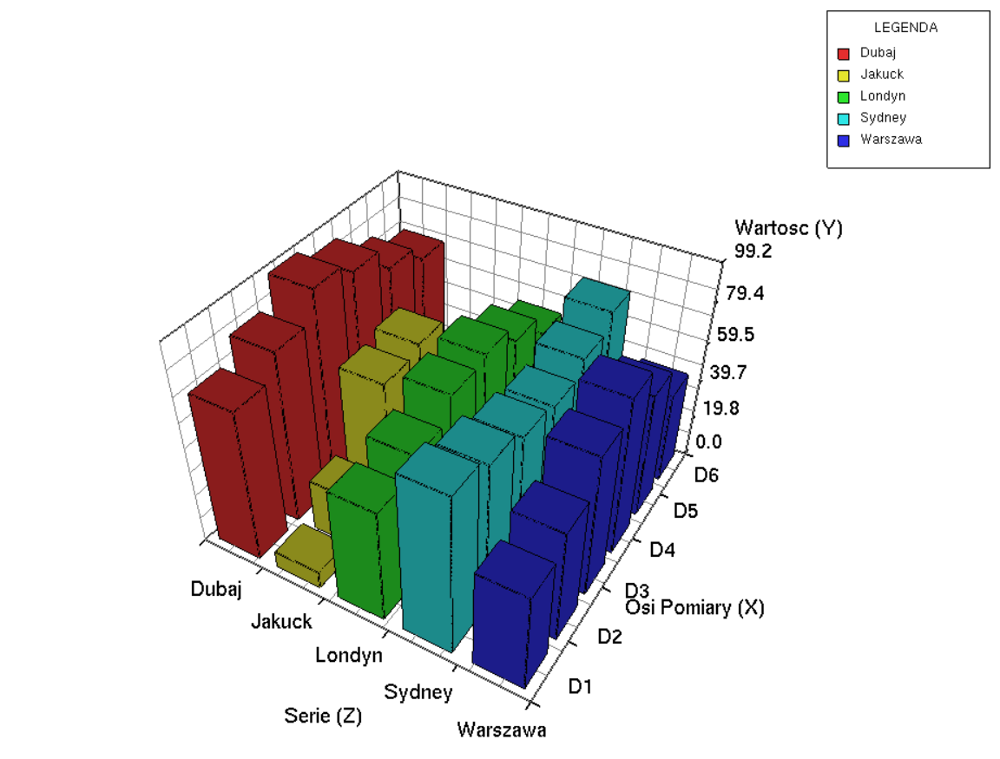
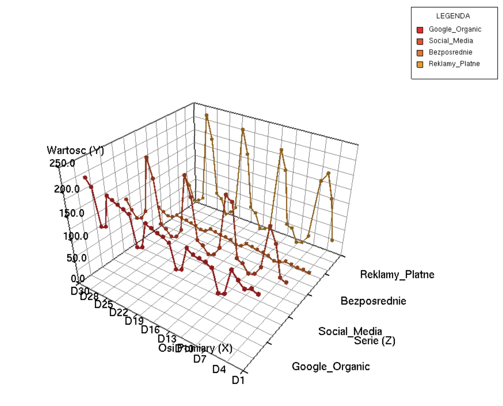
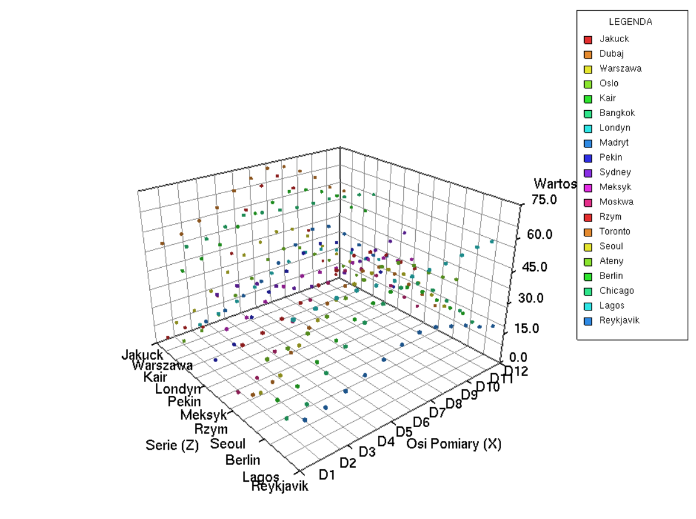

# 3D Data Visualizer (OpenGL)

---
## 📋 Project Description
An application for visualizing data sets in 3D space.  
This project was developed as part of the *Computer Graphics* course.  
The program enables generation of 3D histograms and bar charts based on loaded data files.

---
## 🚀 Features
- **3D Visualization:** Rendering data as 3D bars.
- **Data Loading:** User-selectable input data files.
- **Interface:** Grid, markers, and labeled X, Y, Z axes.
- **Analysis:** Automatic histogram generation.

---
## 📸 Gallery

| Bar Visualization | Line Plot (Series) | Point Cloud |
| :---: | :---: | :---: |
|  |  |  |

---
## ⚙️ Technologies & Mathematics
The project uses the modern **programmable graphics pipeline**:
- **Shaders (GLSL):** Custom vertex and fragment shaders implementing the Phong lighting model (Ambient, Diffuse, Specular).
- **GLM (OpenGL Mathematics):** Advanced matrix operations for Model-View-Projection transformations.
- **VBO/VAO Buffers:** High performance through storing geometry directly in GPU memory.
- **Dynamic File Parsing:** Intelligent text file loader supporting custom separators and labels.

---
## 📂 File Structure
- `main.cpp` – Main application loop and initialization.
- `shadersLoader.cpp/h` – GLSL shader compilation and management.
- `tekstura.cpp/h` – Texture and material handling.
- `*.glsl` – Vertex and fragment shader source files.

---
## 🎮 Controls

| Key / Mouse | Action |
| :--- | :--- |
| **LMB + Move** | Scene rotation (Orbit) |
| **Scroll / RMB** | Zoom in / out |
| **N key** | Load next data file |
| **H key** | Toggle mode (Bars / Lines / Points) |
| **ESC** | Exit application |

---
## 🚀 Quick Start

### Requirements
- Visual Studio 2019/2022 (Recommended)
- Libraries: GLEW, FreeGLUT / GLFW
- `.txt` data sets (examples available in the `/data` directory)

---
### Installation
1. Clone the repository:  
   `git clone https://github.com/your-username/3d-data-visualizer.git`
2. Open the `.sln` file in Visual Studio.
3. Ensure all required libraries are properly linked (Linker / Include settings).
4. Build and run the project (F5).

---
## 👥 Authors
- [Oliwier Stecyk](https://github.com/OliwierStecyk)
- [Jakub Smaga](https://github.com/Heimerin)
